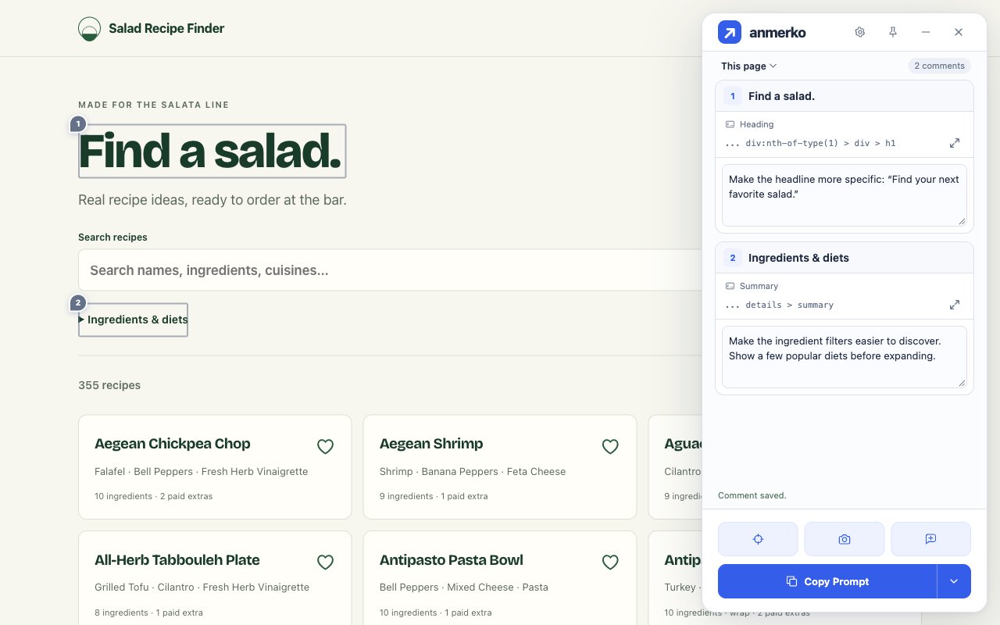

<p align="center">
  
</p>

<h1 align="center">anmerko</h1>

<p align="center">
Collect website comments and screenshots, then share them with your AI agent.
</p>

<p align="center">
  <a href="https://anmerko.com/">Website</a> ·
  <a href="https://anmerko.com/docs/">Documentation</a> ·
  <a href="https://github.com/htxryan/anmerko/releases">Releases</a>
</p>

## Get started

anmerko targets Chrome, Edge, and Firefox on desktop, and Edge and Firefox for Android on mobile. It stores feedback in your browser and needs no account or AI API key; you choose when to export or share it. Chrome 0.5.5, Edge 0.5.5, and Firefox 0.5.5 are publicly listed. Approved manual downloads remain anmerko 0.5.5 for Chrome/Edge and signed 0.5.5.1 for Firefox.

- [Installation guides](https://anmerko.com/docs/install/)
- [Add comments](https://anmerko.com/docs/usage/) and [send feedback to your agent](https://anmerko.com/docs/send-to-your-agent/)
- [Settings](https://anmerko.com/docs/settings/), [troubleshooting](https://anmerko.com/docs/troubleshooting/), and [release notes](https://anmerko.com/docs/releases/)

Try it on [Salad Recipe Finder](https://saladrecipefinder.com/): select the “Find a salad.” heading and add a comment.



## Development

Use Node.js 24+. From the repository root:

```sh
npm ci
npx playwright install chromium
npm run check
npm run site:build
```

`site:build` compiles the current shared demo UI and uses approved installer bytes.
Private release assets require authenticated `gh` or `GH_TOKEN` with repository read access.

Development guides are kept in this repository:

- [Build and test](docs/development.md)
- [CI scopes, release validation and promotion](docs/release-process.md)
- [Site deployment and rollback](docs/site-deployment.md)
- [Store publishing and listing assets](docs/store/distribution.md)
- [Project agent skills for Codex CLI, Claude Code, and OpenCode](.agents/README.md)

Existing store identities and signed historical artifacts retain their original identifiers so updates and release verification remain valid. See [identity and channel guidance](docs/store/distribution.md).

User documentation source is in `site/src/content/docs/docs/`.

## License

[MIT](LICENSE) © 2026 Ryan Henderson.
